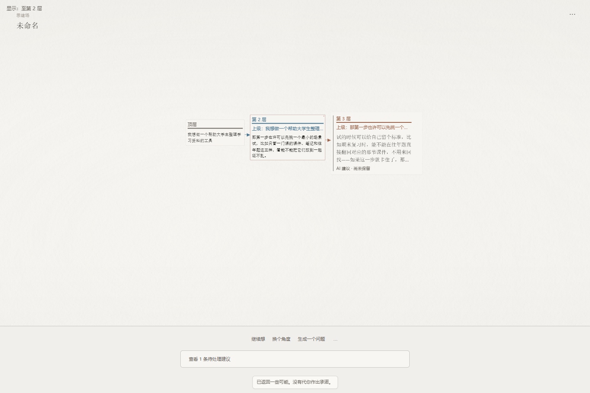
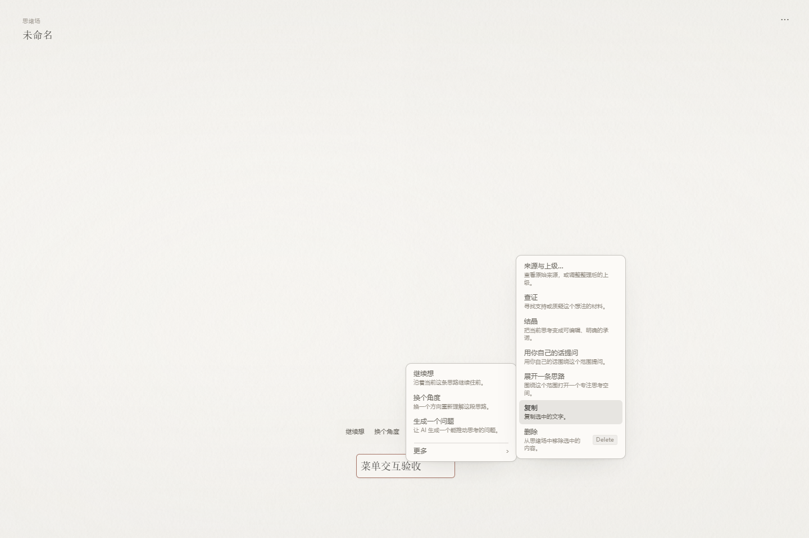

# Diffusion Issue #11 优化体验版

Windows x64，2026-10-02。此安装包包含 Issue #11 的全部已实现优化及后续反馈修复，源码位于组织仓库的 `codex/issue11-feedback-repairs` 分支，审查入口为 [PR #17](https://github.com/NekoMint-Labs/Diffusion/pull/17)。前置界面优化位于依赖 PR #13–#16，均已包含在安装包中。

## 下载与安装

从 [体验版 Release](https://github.com/NekoMint-Labs/Diffusion/releases/tag/issue11-preview-20261002) 下载 `Diffusion-05c4144-three-fixes-x64-setup.exe`。关闭旧版后运行安装包。应用内部版本号仍为 `0.3.0`；本体验版通过发布标签、文件名及源码提交区分。

如使用已有项目，先用应用的导出功能保存一份副本。此版新增可选的组织上级字段，旧项目可打开；旧客户端再次保存该字段的兼容性尚未验收。

- 安装包产品源码：`05c4144522befeeec8a91b533b65e61719a30796`。
- 文件大小：15,305,013 字节。
- SHA-256：`0c4637de19fdad5b2797519c7ddbb437b38b0dce5d675e9f85660661330412a9`。
- 这是 Windows NSIS 体验安装包，最终原生人工验收仍在进行。

## 可以体验哪些变化

1. **更清晰的建议与已保留想法**：待保留建议有柔和纸面、细侧线及明确标记，留下/忽略直接可用。低倍率中文编辑、Find 和稀疏整体视图保持可读。
2. **真正逐层展开的层级**：普通滚轮每次展开或收起一层；收起深层选中内容后，上级仍保留。深链阅读尺寸以正常字号为上限，反复上滚不会持续放大。
3. **当前上级与原始来源分开**：明确、可撤销地调整组织上级；原始来源仍可查看。箭头表达当前上级，颜色及线型区分深度，可在设备上选择曲线或折线。
4. **连续生成更稳定**：新建议按实际渲染尺寸避开来源和界面控件；留下后再继续想也有回归覆盖。已保留内容及手动放置的建议保持用户位置。
5. **“更多”菜单稳定**：窗口中部、底部及右侧均可悬停移入；点击固定展开，实际动作执行一次。键盘进入、Escape 返回及外部点击关闭有测试覆盖。
6. **区域标签随视角退场**：区域标题和数量只在整体概览显示；放大、选择区域及重开后不会常驻近景。
7. **整套界面更统一**：设置、搜索、历史和思考面板改善中文换行、长内容阅读和标题对齐；四套主题有独立配色，五种背景仍可使用；减少动态效果设置立即生效。

## 五分钟体验路线

打开空白项目或独立演示项目 → 写中文想法并换行 → 继续想 → 留下一条建议后再次继续想 → 滚轮逐层观察及收起 → 查看当前上级与来源、调整上级并撤销 → 在窗口底部/右侧打开“更多” → 切换主题 → 放大和缩小检查区域标签。

手动操作无需 API Key；AI 动作需要自行配置已有支持的提供方。自动测试中的生成响应是确定性测试数据，尚未宣称真实在线模型质量已通过验收。

## 已执行验证

最新产品源码通过 TypeScript/生产构建、45 个单元测试文件共 338 项、266 项离线契约及源码检查；37 项针对菜单、连续生成、区域、层级、编辑、Find、拖动和主题的浏览器回归通过，另加 3 项菜单实际调用计数检查。Windows release 编译、NSIS 打包、发现引擎源码校验及发行许可证整理完成。

此前 `2e34c92` 的完整浏览器套件与线上 CI 已通过；它们是历史证据。当前提交的完整 CI/E2E 结果请查看 [PR #17 检查](https://github.com/NekoMint-Labs/Diffusion/pull/17/checks)。编译和浏览器测试不能代替本安装包的真实中文输入法、原生焦点、系统缩放及在线服务体验。

反馈请记录复现步骤、使用的安装包文件名、窗口/缩放设置，提交到 [Issue #11](https://github.com/NekoMint-Labs/Diffusion/issues/11) 或 [PR #17](https://github.com/NekoMint-Labs/Diffusion/pull/17)。

## 固定场景截图

以下 1440×960 截图来自确定性中文测试场景。

连续生成、保留后再次生成及层级上下文：

窗口底部的“更多”菜单：

